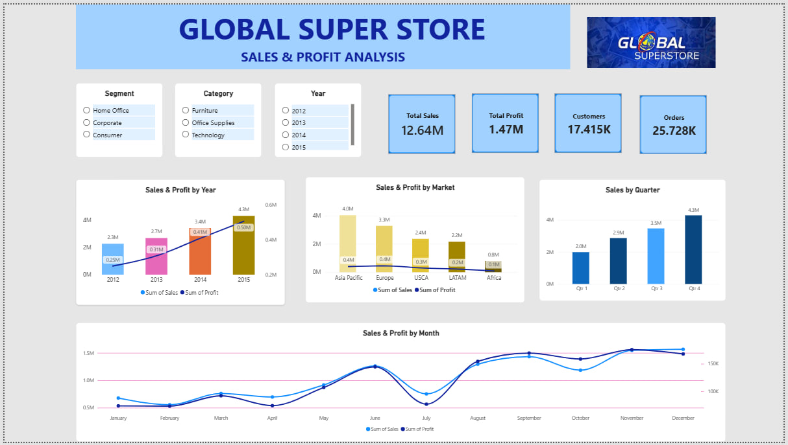

# Global Super Store – Power BI Dashboard

## 📊 Project Overview

An interactive Power BI dashboard developed to analyze the sales and profitability performance of Global Super Store.

The dashboard provides a visual overview of sales, profit, customers, orders, market performance, yearly trends, monthly trends, and quarterly sales.

## 🎯 Business Objectives

- Analyze overall sales and profit performance
- Track sales trends across different years
- Identify monthly sales and profit patterns
- Compare sales and profitability across different markets
- Analyze quarterly sales performance
- Enable interactive analysis using Segment, Category, and Year filters

## 🛠️ Tools & Technologies

- Microsoft Power BI
- CSV Dataset
- Data Visualization
- Interactive Slicers

## 📈 Dashboard Features

### Key Performance Indicators
- Total Sales
- Total Profit
- Customers
- Orders

### Visual Analysis
- Sales & Profit by Year
- Sales & Profit by Market
- Sales by Quarter
- Sales & Profit by Month

### Interactive Filters
- Segment
- Category
- Year

## 🖼️ Dashboard Preview

## 📁 Project Files

- Global Superstore.csv – Dataset used for the dashboard
- Dashboard.jpg – Dashboard preview
- README.md – Project documentation

## 📌 Project Status

Version 1 – Initial Power BI Dashboard

This is an initial dashboard project created to practice Power BI data visualization and business analysis. Further improvements in data preparation, data modeling, and advanced DAX measures can be added in future versions.
